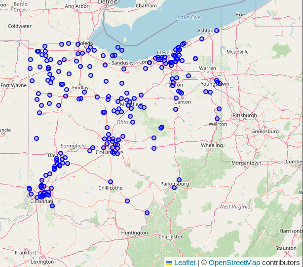

# PostGIS Geo Faker

The project creates fake store and customer data with geospatial
components based on OpenStreetMap.  The use of OpenStreetMap data
as a starting point provides a sense of realism. The use of `random()`
and to generate fake data avoids privacy concerns.

## Load OpenStreetMap Data

Load the region/subregion you want using the PgOSM Flex Docker image.
The [Quick Start section](https://github.com/rustprooflabs/pgosm-flex#quick-start)
loads the data into a PostGIS enabled database in the Docker container,
available on port 5433.

> Update instructions to use custom layerset.  Only need place, road, and land use.


```bash
mkdir ~/pgosm-data
export POSTGRES_USER=postgres
export POSTGRES_PASSWORD=mysecretpassword

docker run --name pgosm -d --rm \
    -v ~/pgosm-data:/app/output \
    -v ~/git/pgosm-flex-faker/:/custom-layerset \
    -v /etc/localtime:/etc/localtime:ro \
    -e POSTGRES_PASSWORD=$POSTGRES_PASSWORD \
    -p 5433:5432 -d rustprooflabs/pgosm-flex

docker exec -it \
    pgosm python3 docker/pgosm_flex.py \
    --ram=8 \
    --region=north-america/us \
    --subregion=ohio \
    --layerset=faker_layerset \
    --layerset-path=/custom-layerset/ 
```


After loading, connect and run the `osm-faker.sql`.
Each time running will generate slightly different results.


Version 1



Version 2


